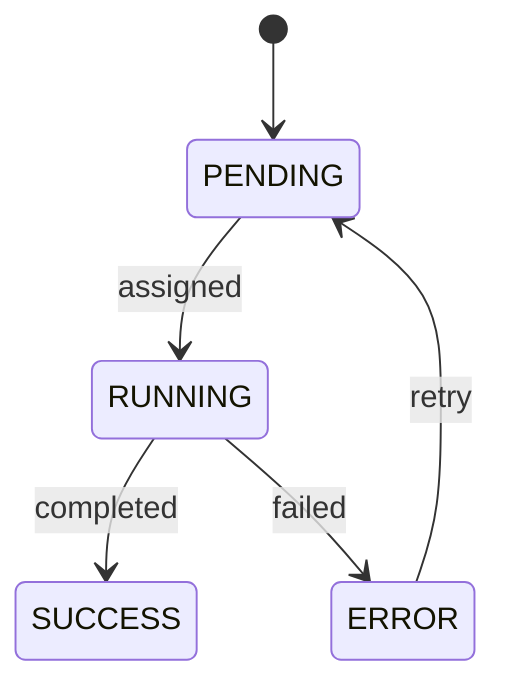

# Design Rationale

## Introduction

This document explains the **why** behind key architectural decisions in the Multi-Agent Coordination (MAC) MCP Server. It serves as a companion to the architecture specification, providing deeper context for design choices.

## Core Design Decisions

### 1. Centralized Orchestration vs. Distributed Choreography

**Decision**: Use centralized orchestrator (Supervisor/Worker pattern)

**Alternatives Considered**:
- Peer-to-peer choreography (agents communicate directly)
- Blackboard architecture (shared memory space)
- Pub/Sub message bus

**Rationale**:

#### Why Centralization Wins for HITL

The primary driver is **Human-in-the-Loop integration**. Consider these scenarios:

**Scenario A: Distributed Choreography**
```
Agent A: "Should I use MySQL or PostgreSQL?"
Agent B: "Should I use REST or GraphQL?"
Agent C: "Should I implement OAuth or SAML?"

→ Human receives 3 simultaneous requests
→ Context-switching overhead
→ Potential inconsistent decisions
```

**Scenario B: Centralized Orchestration**
```
Orchestrator: Receives 3 questions from agents
              Detects they're related (all about auth system)
              Bundles into single coherent request:

"Please decide on the tech stack for authentication:
 - Database: MySQL vs PostgreSQL
 - API: REST vs GraphQL
 - Auth: OAuth vs SAML"

→ Human sees coherent decision point
→ Context preserved
→ Consistent choices guaranteed
```

#### Debugging Complexity

**Choreography**: O(N²) communication paths
- 5 agents = 20 possible communication pairs
- Debugging requires tracing message flow across peers
- No single source of truth

**Orchestration**: O(N) communication paths
- 5 agents = 5 agent-orchestrator connections
- Complete audit trail in one event log
- Single source of truth

#### LLM Agent Characteristics

LLM agents have unique properties that favor orchestration:

1. **Stateless**: LLMs don't maintain internal state between calls
   - Orchestrator can freely reassign tasks without coordination overhead

2. **Prompt-Driven**: LLMs need clear, well-structured prompts
   - Centralized task definitions ensure consistent prompting

3. **Non-Deterministic**: Same prompt may yield different outputs
   - Orchestrator can detect divergence and request HITL arbitration

**Verdict**: Centralization is optimal for HITL-first, LLM-based systems.

---

### 2. Pull-based vs. Push-based Task Assignment

**Decision**: Pull-based (agents request work)

**Rationale**:

#### Backpressure Handling

**Push Model Problem**:
```python
# Orchestrator assigns task to agent
orchestrator.assign_task(task, agent)

# What if agent is overloaded?
# - Task queues up (memory pressure)
# - Agent can't reject (no agency)
# - Orchestrator doesn't know agent capacity
```

**Pull Model Solution**:
```python
# Agent requests work when ready
task = orchestrator.claim_task(agent.capabilities)

# Agent controls its own workload
# - No task queuing (orchestrator holds pending tasks)
# - Agent decides when to take more work
# - Self-regulating system
```

#### Load Balancing

Pull-based systems naturally balance load:
- Fast agents consume more tasks
- Slow agents consume fewer tasks
- No manual load balancing logic needed

#### Failure Modes

**Push**:
```
Orchestrator → [Assigns task] → Agent (crashed, no response)
                [Timeout required to detect failure]
                [Task stuck in limbo during timeout]
```

**Pull**:
```
Agent (crashed) → [No claim request]
                  [Orchestrator immediately knows agent unavailable]
                  [Task remains in PENDING, available for others]
```

#### WebSocket Enhancement

Pure pull has latency overhead (polling). Hybrid approach:

```
Orchestrator: [New task available]
    │
    ├─> WebSocket broadcast: "Task available matching: python, testing"
    │
Agents (listening): "I match! Let me claim it"
    │
    └─> claim_task() → Orchestrator assigns
```

Benefits:
- Low latency (WebSocket push)
- Backpressure preserved (agent still pulls)
- Scalable (agents only claim if ready)

**Verdict**: Pull-based with optional WebSocket notifications combines best of both worlds.

---

### 3. Event Sourcing with JSONL vs. Traditional Database

**Decision**: Append-only JSONL event log as source of truth

**Rationale**:

#### Immutability Benefits

**Traditional Database** (UPDATE operations):
```sql
UPDATE tasks SET state = 'COMPLETED', progress = 1.0 WHERE id = 't1';
```
**Problem**: Lost history. Can't answer:
- Who changed the state?
- When did it change?
- What was the previous state?
- Why did it change?

**Event Sourcing** (INSERT only):
```jsonl
{"type":"task_assigned","task_id":"t1","agent_id":"a1","timestamp":"...","sequence":5}
{"type":"task_progress","task_id":"t1","progress":0.3,"timestamp":"...","sequence":6}
{"type":"task_progress","task_id":"t1","progress":0.7,"timestamp":"...","sequence":7}
{"type":"task_completed","task_id":"t1","timestamp":"...","sequence":8}
```
**Benefit**: Complete history preserved. Audit trail built-in.

#### Debugging & Time Travel

Real debugging scenario:
```
User: "Why did task t1 fail?"

With Database:
- Current state: ERROR
- Error message: "Dependency missing"
- ??? (no history of what led to this state)

With Event Log:
1. task_created (t1, depends on t2)
2. task_assigned (t1 → agent_a1)
3. dependency_requested (t1 needs t2)
4. task_failed (t2 failed)  ← Root cause!
5. task_failed (t1 cascade failure)
```

Time travel debugging:
```bash
# Replay events up to sequence 100
cat events.jsonl | head -100 | replay_state

# See exact system state at that point in time
```

#### JSONL Format Advantages

**Why JSONL over binary formats (Protobuf, Avro)?**

1. **Human-Readable**:
   ```bash
   cat events.jsonl | jq 'select(.type == "task_failed")'
   # Instant debugging with standard tools
   ```

2. **Streamable**:
   ```python
   for line in open('events.jsonl'):
       event = json.loads(line)
       process(event)  # O(1) memory, infinite stream
   ```

3. **Append-Safe**:
   - Crashed writes leave partial line (easily detected/trimmed)
   - No corruption of previous events
   - No indexes to rebuild

4. **Compressible**:
   - gzip achieves ~10x compression on JSON
   - Still streamable with gzip streaming

**Trade-offs**:

| Aspect | JSONL | Database |
|--------|-------|----------|
| Write Speed | Excellent (O(1) append) | Good (indexed writes) |
| Read Speed (full scan) | Good (sequential) | Excellent (indexes) |
| Query Speed | Poor (requires full scan) | Excellent (B-tree indexes) |
| Storage | Good (compresses well) | Excellent (binary) |
| Debuggability | Excellent | Poor |

**Mitigation**: Use snapshots + secondary indexes

```
events.jsonl      [Canonical source of truth]
    │
    ├─> snapshot.json  [Rebuild from events every N records]
    └─> index.db       [SQLite for fast queries: task by state, agent by capability]
```

Query path:
1. Load latest snapshot (O(1))
2. Replay events since snapshot (O(N) where N is small)
3. Use index for specific queries

**Verdict**: JSONL event sourcing provides superior debuggability and audit trail at acceptable performance cost.

---

### 4. State Machine Formalism

**Decision**: Explicit state machine with defined transitions

**Rationale**:

#### Preventing Invalid States

**Without State Machine** (ad-hoc state):
```python
task.state = "running"
task.progress = 0.5
task.result = None
task.error = None

# Later, bug introduced:
task.state = "completed"
task.error = "Some error"  # Wait, completed but has error?
```

**With State Machine**:
```python
class TaskState(Enum):
    PENDING = auto()
    RUNNING = auto()
    SUCCESS = auto()
    ERROR = auto()

def transition(task, event):
    if task.state == RUNNING and event.type == "completed":
        task.state = SUCCESS
        task.result = event.payload
        # Impossible to set error in SUCCESS state
```

#### Exhaustive Testing

State machine enables complete test coverage:

```python
# Generate all possible (state, event) combinations
for state in TaskState:
    for event_type in EventType:
        test_transition(state, event_type)
        # Assert: transition is either valid or explicitly rejected
```

#### Visual Verification

State machines can be visualized and verified by humans:



Non-technical stakeholders can verify correctness.

#### Formal Verification

State machines can be formally verified using tools like TLA+:

```tla
TaskStateMachine ==
  /\ state \in {PENDING, RUNNING, SUCCESS, ERROR}
  /\ state = RUNNING => assigned_agent != null
  /\ state = SUCCESS => result != null
  /\ state \in {SUCCESS, ERROR} => progress = 1.0
```

**Verdict**: Explicit state machines prevent bugs, enable testing, and support formal verification.

---

### 5. Capability-Based Task Matching

**Decision**: Tasks declare required capabilities; agents declare provided capabilities

**Rationale**:

#### Type Safety for Skills

**Problem**: How to ensure agents can actually perform assigned tasks?

**Alternative 1: Manual Assignment**
```python
orchestrator.assign_task(task_id="write_tests", agent_id="code_gen_agent")
# Oops! Code gen agent doesn't know how to write tests
```

**Alternative 2: Capability Matching**
```python
task = Task(
    description="Write unit tests",
    required_capabilities=["python", "pytest", "testing"]
)

agent = Agent(
    id="test_agent",
    capabilities=["python", "pytest", "testing", "unittest"]
)

if agent.capabilities.intersection(task.required_capabilities):
    # Safe to assign!
```

#### Extensibility

Capabilities are **open-ended**:
- Start simple: `["python", "testing"]`
- Add granularity: `["python", "pytest", "unit_testing", "integration_testing"]`
- Add domains: `["python", "pytest", "web_scraping"]`

No orchestrator code changes needed.

#### Multi-Dimensional Matching

Future: Semantic matching with embeddings

```python
task_embedding = embed(["write tests for authentication"])
agent_embedding = embed(["python testing expert with auth experience"])

similarity = cosine_similarity(task_embedding, agent_embedding)
if similarity > 0.8:
    assign(task, agent)
```

**Verdict**: Capability-based matching is flexible, extensible, and enables semantic search.

---

### 6. HITL at Orchestrator Level vs. Agent Level

**Decision**: Orchestrator mediates all HITL requests

**Rationale**:

#### Context Aggregation

Agents have narrow context. Orchestrator has full context.

**Scenario**: Building authentication system

**Agent-Level HITL**:
```
DB Agent: "Use users table or accounts table?"
API Agent: "Use session tokens or JWTs?"
Test Agent: "Test with mock users or real database?"

→ Three disconnected questions
→ Human doesn't see relationships
→ Answers may be inconsistent
```

**Orchestrator-Level HITL**:
```
Orchestrator detects: All three questions relate to auth system design
                     Bundles into coherent decision tree:

"Authentication System Design Decisions:
1. Database: Users table with JWTs (recommended)
   - DB Agent needs table name
   - API Agent needs token strategy
   - Consistent naming across layers

2. Testing Strategy:
   - Use real database with test fixtures
   - Aligns with JWT strategy (needs DB for validation)

Approve? [Y/n/modify]"

→ Human sees big picture
→ Consistent decisions guaranteed
```

#### Priority & Urgency Management

Orchestrator can prioritize HITL requests:

```python
hitl_queue = [
    ("Critical security decision", urgency=HIGH),
    ("Nice-to-have: documentation style", urgency=LOW),
    ("Blocking: choose database", urgency=MEDIUM)
]

# Present in priority order
# Or batch low-urgency requests
```

#### Audit & Compliance

Centralized HITL enables compliance:

```jsonl
{"type":"hitl_request","request_id":"h1","question":"Deploy to prod?","timestamp":"..."}
{"type":"hitl_response","request_id":"h1","responder":"alice@company.com","decision":"approve","timestamp":"..."}
```

Auditors can verify:
- Who approved what
- When they approved it
- What context they had

Distributed HITL makes this impossible.

**Verdict**: Orchestrator-level HITL provides better UX, consistency, and auditability.

---

## Advanced Design Choices

### 7. Heartbeat-Based Liveness vs. Explicit Shutdown

**Decision**: Heartbeat required; missed heartbeats = failure

**Rationale**:

Agents can fail in many ways:
- Process crash (no chance to send "goodbye")
- Network partition (can't reach orchestrator)
- Infinite loop (process running but not responsive)

**Explicit shutdown only**:
```python
agent.send("shutdown")  # Only works if agent is responsive
```

**Heartbeat-based**:
```python
# Agent required to send heartbeat every 30s
if now() - agent.last_heartbeat > 90s:
    assume_failed(agent)
    reassign_tasks(agent)
```

Catches all failure modes, including unresponsive processes.

### 8. Retryable vs. Non-Retryable Errors

**Decision**: Agents declare error retryability; orchestrator decides action

**Rationale**:

Not all errors are equal:

**Retryable** (transient failures):
- Network timeout: Retry same agent
- Resource exhaustion: Retry after delay
- External service down: Retry with backoff

**Non-Retryable** (permanent failures):
- Logic error in agent code: Retry won't help
- Missing capability: Need different agent
- Invalid input: Need HITL clarification

**Agent declares, orchestrator decides**:
```python
agent.fail_task(
    task_id="t1",
    error={
        "type": "network_timeout",
        "retryable": True  # Agent's assessment
    }
)

# Orchestrator checks:
if error.retryable and task.retry_count < MAX_RETRIES:
    reassign_to_same_agent_with_delay()
else:
    escalate_to_hitl()
```

Separation of concerns:
- Agent: Domain expert (knows what failed)
- Orchestrator: Policy expert (decides what to do)

### 9. Task Dependencies as DAG vs. Sequential Workflow

**Decision**: Directed Acyclic Graph (DAG) of tasks

**Rationale**:

**Sequential** (limited parallelism):
```
t1 → t2 → t3 → t4 → t5
     (5 tasks, 5 time units if each takes 1 unit)
```

**DAG** (maximal parallelism):
```
    t1
    ├─→ t2 → t4
    └─→ t3 → t5

(5 tasks, 3 time units with 2 parallel agents)
```

Real example: Build web app
```
    Design Schema (t1)
         │
         ├─→ Backend API (t2) → Integration Tests (t4)
         │                   ↗
         └─→ Frontend (t3) ──┘
```

Sequential: 4 time units
DAG: 3 time units (t2 and t3 in parallel)

**Verdict**: DAG enables parallelism, faster completion.

### 10. Immutable Events vs. Event Corrections

**Decision**: Events are immutable; corrections are new events

**Rationale**:

**Mutable Events** (UPDATE):
```jsonl
{"type":"task_assigned","task_id":"t1","agent_id":"a1","sequence":5}
# Oops, wrong agent! Update the event:
{"type":"task_assigned","task_id":"t1","agent_id":"a2","sequence":5}  # Modified
```
**Problem**: Lost history. Can't debug why a1 was initially chosen.

**Immutable Events** (INSERT):
```jsonl
{"type":"task_assigned","task_id":"t1","agent_id":"a1","sequence":5}
{"type":"task_reassigned","task_id":"t1","from_agent":"a1","to_agent":"a2","reason":"capability_mismatch","sequence":6}
```
**Benefit**: Full history. Debugging reveals initial assignment logic.

Audit trail intact:
- "Why is a2 doing this task?" → Check sequence 6
- "Why was a1 unassigned?" → reason: capability_mismatch
- "Who made the initial assignment?" → Check sequence 5

**Verdict**: Immutability preserves debugging context.

---

## Future-Proofing Decisions

### 11. MCP-Native Design

**Decision**: Build on MCP tools/resources, not custom protocol

**Rationale**:

MCP is becoming an industry standard:
- Anthropic's Claude Desktop supports it
- OpenAI adopted it (March 2025)
- Growing ecosystem of tools/servers

**Benefits of MCP-Native**:
1. **Interoperability**: Works with any MCP client
2. **Tooling**: Leverage existing MCP SDKs, debuggers
3. **Future-Proof**: MCP evolution benefits MAC automatically
4. **Community**: Tap into MCP community resources

**Alternative**: Custom protocol (GRPC, custom JSON-RPC)
- Requires custom client implementations
- Isolated from MCP ecosystem
- Reinventing the wheel

**Verdict**: MCP-native design ensures long-term viability.

### 12. Pluggable Storage Backend

**Decision**: Abstract event store interface; multiple implementations

**Rationale**:

Different deployments have different needs:

**Development**: In-memory (fast, ephemeral)
**Testing**: In-memory or file (repeatable)
**Production**: File or database (durable)
**High-Throughput**: Kafka or Kinesis (streaming)

**Interface**:
```python
class EventStore(Protocol):
    def append(self, event: Event) -> None
    def read(self, since: int) -> Iterator[Event]
    def snapshot(self) -> State
```

**Implementations**:
- `InMemoryEventStore`: List of events
- `FileEventStore`: JSONL file with fsync
- `DatabaseEventStore`: PostgreSQL with transactional writes
- `KafkaEventStore`: Distributed streaming

No orchestrator logic changes across backends.

**Verdict**: Abstraction enables evolution without rewrites.

---

## Security Design Choices

### 13. Message Signing vs. Encryption

**Decision**: Sign events with HMAC-SHA256; no encryption by default

**Rationale**:

**Threat Model**:
1. **Tampering**: Malicious actor modifies event log
2. **Spoofing**: Malicious agent impersonates another
3. **Eavesdropping**: Attacker reads sensitive data

**Mitigation Strategy**:

**Tampering → Message Signing**:
```jsonl
{"type":"task_completed","task_id":"t1","result":{...},"signature":"a1b2c3..."}
```
- Orchestrator signs with secret key
- Consumers verify signature
- Tampered events detected

**Spoofing → Authentication**:
- JWT tokens with `agent_id` claim
- Token required for all operations
- Prevents impersonation

**Eavesdropping → Transport Encryption**:
- Use TLS/HTTPS for transport
- Event log stored on orchestrator (access-controlled)
- No sensitive data in events (references only)

**Why not encrypt events?**
- Breaks debuggability (can't grep logs)
- Key management complexity
- Encrypted logs can't be indexed/searched
- Overkill for most deployments (orchestrator is trusted)

**When to encrypt**:
- Multi-tenant deployments with untrusted orchestrator
- Regulatory requirements (HIPAA, GDPR)
- Use: `{"type":"task_result","result":"<encrypted_blob>","key_id":"...}"}`

**Verdict**: Signing prevents tampering; encryption optional for high-security scenarios.

---

## Open Questions & Future Research

### 14. Agent Pricing & Cost Optimization

**Challenge**: LLM API calls are expensive. How to minimize cost?

**Potential Approaches**:

**Approach A: Cost-Aware Scheduling**
```python
task = Task(description="Write tests", priority=LOW)

# Prefer cheaper agents for low-priority tasks
cheap_agent = find_agent(capability="testing", cost="<$0.01/call")
expensive_agent = find_agent(capability="testing", model="opus")

if task.priority == LOW:
    assign(task, cheap_agent)
```

**Approach B: Partial Re-Use**
```python
# Check if similar task was done before
similar_task = find_similar(task, threshold=0.9)
if similar_task:
    # Reuse result with human approval
    hitl_request("Reuse previous implementation with modifications?")
```

**Approach C: Hybrid Execution**
- Use cheap agent for first draft
- Use expensive agent for review/refinement

**Open Research**: Optimal cost/quality trade-off.

### 15. Cross-Goal Learning

**Challenge**: Can agents learn from past executions?

**Idea**: Decomposition Templates
```python
goal = "Build REST API for X management"

# Search past goals
template = find_similar_goal_decomposition("Build REST API for users")

# Adapt template
adapted_dag = template.adapt(domain="X")

# Show to human
hitl_request("Reuse this task breakdown?", adapted_dag)
```

**Benefits**:
- Faster decomposition (no LLM call)
- Consistency across similar goals
- Institutional knowledge

**Challenges**:
- Similarity detection (embedding-based search)
- Template adaptation (how to generalize?)
- When to create template vs. from scratch?

**Open Research**: Meta-learning for task decomposition.

---

## Conclusion

The MAC architecture is the result of careful consideration of:

1. **LLM Agent Characteristics**: Stateless, prompt-driven, non-deterministic
2. **HITL First**: Human intervention is primary constraint
3. **Debuggability**: Engineers must be able to diagnose failures
4. **Fault Tolerance**: Agents will fail; system must recover
5. **Future-Proofing**: Design for evolution, not just current needs

Every design choice prioritizes **correctness**, **observability**, and **human agency** over raw performance or implementation convenience.

The result is a system that is:
- **Sound**: Based on proven distributed systems patterns
- **Safe**: HITL prevents runaway automation
- **Debuggable**: Complete audit trail enables root cause analysis
- **Evolvable**: Abstractions enable growth without rewrites

---

**Next Steps**: See [ARCHITECTURE.md](./ARCHITECTURE.md) for complete specification and [PROTOCOL.md](./PROTOCOL.md) for formal protocol definition.
