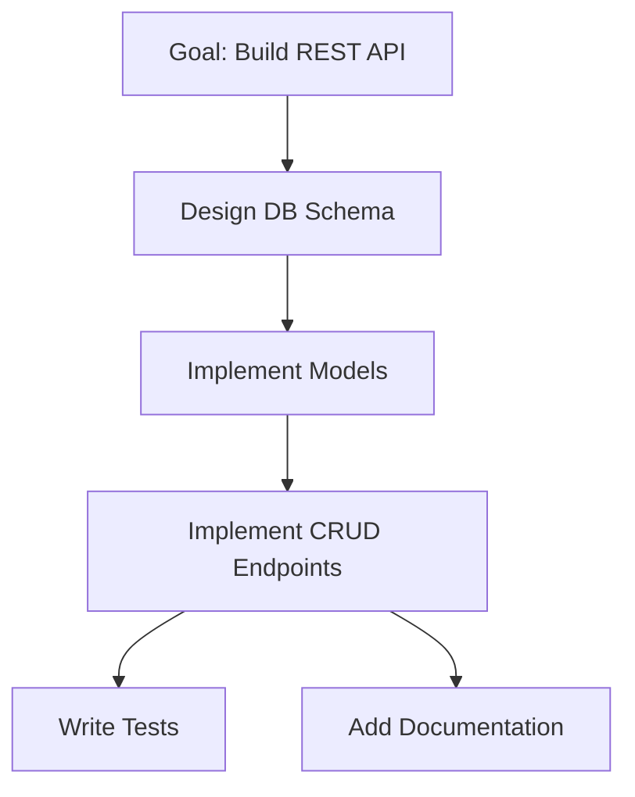

# Multi-Agent Coordination MCP Server

> A protocol-sound orchestrator for autonomous LLM-based agent teams

## Overview

The **Multi-Agent Coordination (MAC) MCP Server** is a central orchestrator that coordinates teams of autonomous AI agents to accomplish complex goals. Built on the [Model Context Protocol (MCP)](https://modelcontextprotocol.io/), it provides robust task decomposition, state management, fault tolerance, and human-in-the-loop (HITL) integration.

### Key Features

- **🎯 Goal Decomposition**: Transforms complex goals into executable task graphs (DAGs)
- **🤖 Agent Orchestration**: Supervisor/Worker pattern with capability-based task assignment
- **🔄 State Management**: Deterministic state machine with event sourcing (JSONL format)
- **🛡️ Fault Tolerance**: Heartbeat monitoring, automatic task reassignment, circuit breakers
- **👤 Human Integration**: Centralized HITL for approvals, conflict resolution, and critical decisions
- **📊 Observable**: Complete audit trail with real-time event streaming
- **🔌 MCP-Native**: Built on standard MCP tools and resources

## Architecture Highlights

### Layered Design

```
┌─────────────────────────────────────────────────────────┐
│                    MCP Client Layer                      │
│              (Claude Desktop, SDKs, etc.)                │
└─────────────────────────────────────────────────────────┘
                           ▲
                           │ JSON-RPC 2.0
                           ▼
┌─────────────────────────────────────────────────────────┐
│              MAC Orchestrator (MCP Server)               │
│  ┌─────────────┐  ┌──────────────┐  ┌────────────────┐ │
│  │   Goal      │  │    Agent     │  │      HITL      │ │
│  │ Decomposer  │  │  Supervisor  │  │   Integrator   │ │
│  └─────────────┘  └──────────────┘  └────────────────┘ │
│  └─────────────────────────────────────────────────────┤ │
│              Task State Machine & Event Log             │
│  └─────────────────────────────────────────────────────┘ │
└─────────────────────────────────────────────────────────┘
                           ▲
                           │ MCP Tools
                           ▼
┌─────────────────────────────────────────────────────────┐
│                    Agent Workers                         │
│  ┌──────────┐  ┌──────────┐  ┌──────────┐              │
│  │ Agent A  │  │ Agent B  │  │ Agent C  │  ...         │
│  │(Code Gen)│  │(Research)│  │(Testing) │              │
│  └──────────┘  └──────────┘  └──────────┘              │
└─────────────────────────────────────────────────────────┘
```

### Design Principles

1. **Actor Model**: Agents communicate only through the orchestrator (no direct peer-to-peer)
2. **Supervisor Pattern**: Orchestrator monitors agent health and handles failures
3. **Event Sourcing**: All state changes recorded as immutable JSONL events
4. **Pull-based Dispatch**: Agents request work matching their capabilities (not pushed)
5. **Human Primacy**: HITL requests take precedence over agent autonomy

## Quick Start

### Prerequisites

- Python 3.10+
- Model Context Protocol SDK

### Installation

```bash
# Clone the repository
git clone https://github.com/geehexx/mac-mcp.git
cd mac-mcp

# Install dependencies (when implemented)
pip install -e .
```

### Basic Usage

```bash
# Start the orchestrator
mac-mcp serve --mode dev

# In another terminal, submit a goal
mac-mcp goal submit "Build a REST API for user management"
```

### Configuration

```yaml
# config.yaml
orchestrator:
  mode: development  # development | production | headless
  heartbeat_interval_ms: 30000
  max_concurrent_tasks_per_agent: 5

storage:
  backend: file  # file | memory | database
  path: ./events.jsonl

hitl:
  backend: cli  # cli | mcp | web
  strategy: interactive  # interactive | conservative | default
```

## Documentation

### Core Documentation

- **[Architecture Design](./ARCHITECTURE.md)** - Comprehensive system architecture, design patterns, and rationale
- **[Protocol Specification](./PROTOCOL.md)** - Formal protocol definition with message schemas and state transitions
- **[Implementation Guide](./docs/IMPLEMENTATION.md)** _(Coming Soon)_ - Step-by-step implementation guide
- **[API Reference](./docs/API.md)** _(Coming Soon)_ - Complete MCP tools and resources reference

### Concepts

- **[Task Lifecycle](./ARCHITECTURE.md#task-lifecycle)** - State machine and transitions
- **[Agent Communication](./ARCHITECTURE.md#agent-communication-patterns)** - Pull-based task claiming, progress streaming
- **[HITL Integration](./ARCHITECTURE.md#hitl-integration-design)** - Human intervention points and workflows
- **[Fault Tolerance](./ARCHITECTURE.md#fault-tolerance-mechanisms)** - Heartbeats, retries, circuit breakers

## Example Workflow

### Goal: "Build a REST API for user management"



**Event Stream** (abbreviated):

```jsonl
{"type":"goal_submitted","goal_id":"g1","description":"Build REST API...","sequence":1}
{"type":"goal_decomposed","goal_id":"g1","payload":{"task_dag":{...}},"sequence":2}
{"type":"hitl_request","payload":{"question":"Approve decomposition?"},"sequence":3}
{"type":"hitl_response","payload":{"decision":"approve"},"sequence":4}
{"type":"agent_registered","agent_id":"db_agent","capabilities":["database","postgresql"],"sequence":5}
{"type":"task_assigned","task_id":"t1","agent_id":"db_agent","sequence":6}
{"type":"task_progress","task_id":"t1","payload":{"progress":0.5,"message":"Created users table"},"sequence":7}
{"type":"task_completed","task_id":"t1","payload":{"result":{...}},"sequence":8}
{"type":"goal_completed","goal_id":"g1","sequence":42}
```

See [ARCHITECTURE.md Example Workflow](./ARCHITECTURE.md#example-workflow) for complete details.

## MCP Integration

### Tools Provided

The orchestrator exposes 8 MCP tools for agents:

- `register_agent` - Join coordination network
- `claim_task` - Request work matching capabilities
- `report_progress` - Stream task updates
- `complete_task` - Mark task as successful
- `fail_task` - Report task failure
- `request_dependency` - Get output from prerequisite tasks
- `heartbeat` - Liveness signal
- `request_human_input` - Escalate to HITL

### Resources Exposed

Read-only MCP resources for observability:

- `coordination://tasks/{task_id}` - Task details and state
- `coordination://agents/{agent_id}` - Agent status and capabilities
- `coordination://goals/{goal_id}` - Goal progress and DAG
- `coordination://events?since={seq}` - Event stream (JSONL)

### Using with Claude Desktop

Add to your `claude_desktop_config.json`:

```json
{
  "mcpServers": {
    "mac-coordination": {
      "command": "mac-mcp",
      "args": ["serve", "--mode", "production"]
    }
  }
}
```

## Protocol Soundness

MAC is built on well-researched distributed systems patterns:

### Actor Model
- Agents are isolated actors
- Message-passing only (no shared state)
- "Let it crash" philosophy with supervisor recovery

### State Machine
- Tasks follow deterministic state transitions
- States: PENDING → RUNNING → AWAITING → SUCCESS/ERROR
- Replay-safe event log

### Event Sourcing
- Append-only JSONL event log
- State derivable from event replay
- Complete audit trail for debugging

### Supervisor/Worker Pattern
- Orchestrator supervises agent lifecycle
- Heartbeat-based liveness detection
- Automatic failure recovery (restart/reassign/escalate)

## Comparison with Alternatives

| Feature | MAC | Choreography | Blackboard | Workflow Engines |
|---------|-----|--------------|------------|------------------|
| **HITL Integration** | Centralized | Distributed | Manual | Plugin Required |
| **Agent Isolation** | Enforced | Optional | Shared Memory | N/A |
| **Audit Trail** | Complete | Partial | None | Limited |
| **LLM-Centric** | Yes | No | Partial | No |
| **Fault Tolerance** | Supervisor | Peer Recovery | N/A | Retry Logic |
| **Debuggability** | Excellent | Poor | Medium | Medium |

See [ARCHITECTURE.md Comparison](./ARCHITECTURE.md#comparison-with-alternative-architectures) for detailed analysis.

## Security Considerations

### Authentication
- JWT-based agent authentication (recommended)
- API keys for human HITL integration
- Token expiration and refresh

### Message Integrity
- HMAC-SHA256 event signing
- Prevents event log tampering
- Verifiable audit trail

### Resource Limits
- Max concurrent tasks per agent: 5
- Max event payload size: 1 MB
- Max task runtime: 1 hour (configurable)
- Circuit breaker after 3 failures

### Access Control
- Agents access only assigned tasks
- Dependency results mediated by orchestrator
- HITL responses not directly accessible

See [PROTOCOL.md Security Requirements](./PROTOCOL.md#security-requirements) for full specification.

## Development Status

**Current Phase**: Architecture & Protocol Design ✅

### Roadmap

#### Phase 1: Core Orchestrator (MVP)
- [ ] Event store (JSONL file backend)
- [ ] Task state machine implementation
- [ ] Agent registration and heartbeat
- [ ] Basic task assignment (pull model)
- [ ] MCP server implementation

#### Phase 2: HITL Integration
- [ ] CLI-based HITL backend
- [ ] MCP-based HITL integration
- [ ] Goal approval workflow
- [ ] Error escalation

#### Phase 3: Advanced Features
- [ ] Dependency graph optimization
- [ ] WebSocket-based task notifications
- [ ] Semantic capability matching
- [ ] Snapshot-based state reconstruction

#### Phase 4: Production Hardening
- [ ] JWT authentication
- [ ] HMAC message signing
- [ ] Rate limiting and quotas
- [ ] Monitoring and metrics

#### Phase 5: Scalability
- [ ] Distributed orchestrator (Redis)
- [ ] Pluggable storage backends (PostgreSQL, Kafka)
- [ ] Multi-tenancy support

## Contributing

Contributions are welcome! Please see [CONTRIBUTING.md](./CONTRIBUTING.md) _(Coming Soon)_ for guidelines.

### Development Setup

```bash
# Clone the repository
git clone https://github.com/geehexx/mac-mcp.git
cd mac-mcp

# Create virtual environment
python -m venv venv
source venv/bin/activate  # On Windows: venv\Scripts\activate

# Install development dependencies
pip install -e ".[dev]"

# Run tests
pytest

# Run linter
ruff check .
```

## Related Projects

- **[hitl-mcp-cli](https://github.com/geehexx/hitl-mcp-cli)** - Human-in-the-Loop tool via MCP (inspiration for HITL integration)
- **[Model Context Protocol](https://modelcontextprotocol.io/)** - Protocol specification
- **[Claude Desktop](https://claude.ai/download)** - MCP client reference implementation

## Research & References

### Distributed Systems
- Hewitt, C. (1973). "Actor Model of Computation" - Foundation for agent isolation
- Armstrong, J. (2003). "Making reliable distributed systems in the presence of software errors" - Supervisor pattern in Erlang/OTP
- Lamport, L. (1998). "The Part-Time Parliament" - Consensus in distributed systems

### Workflow Orchestration
- [Temporal.io](https://temporal.io/) - Durable execution model
- [AWS Step Functions](https://aws.amazon.com/step-functions/) - State machine-based orchestration
- [Apache Airflow](https://airflow.apache.org/) - DAG-based workflow management

### Event Sourcing
- Fowler, M. (2005). "Event Sourcing" - Pattern for audit trails
- [NDJSON Specification](http://ndjson.org/) - Line-delimited JSON format

## License

MIT License - see [LICENSE](./LICENSE) for details.

## Citation

If you use MAC in academic work, please cite:

```bibtex
@software{mac_mcp_2025,
  author = {geehexx},
  title = {Multi-Agent Coordination MCP Server},
  year = {2025},
  url = {https://github.com/geehexx/mac-mcp},
  note = {Protocol-sound orchestrator for autonomous LLM-based agent teams}
}
```

## Contact

- **Issues**: [GitHub Issues](https://github.com/geehexx/mac-mcp/issues)
- **Discussions**: [GitHub Discussions](https://github.com/geehexx/mac-mcp/discussions)
- **Email**: [Your contact email]

---

**Status**: Architecture & Protocol Design Complete ✅ | Implementation In Progress 🚧

Built with ❤️ by [geehexx](https://github.com/geehexx)
