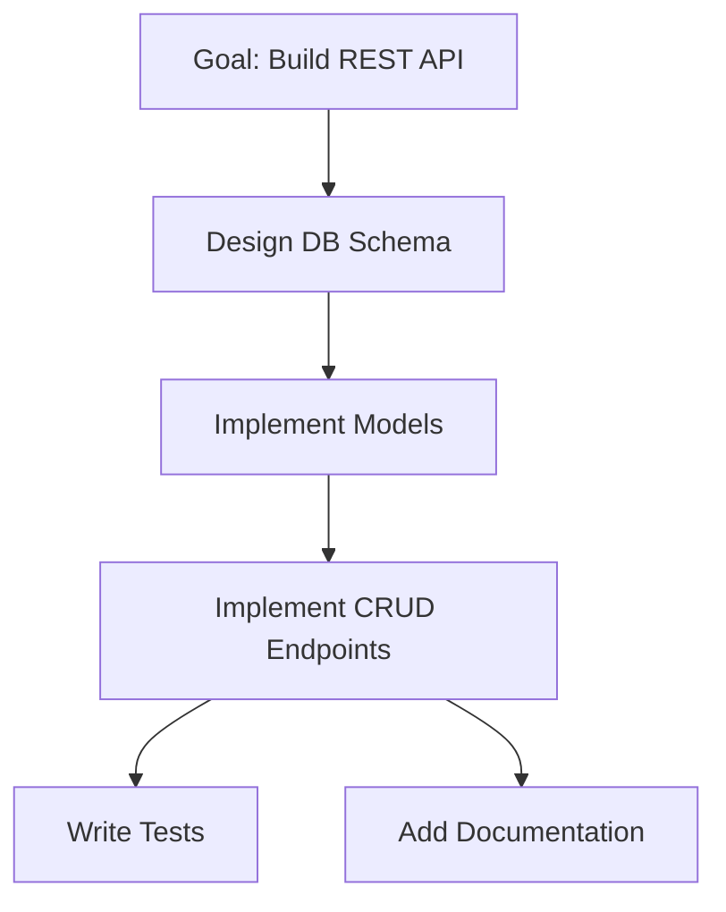

# Multi-Agent Coordination MCP Server

> A protocol-sound orchestrator for autonomous LLM-based agent teams

## Overview

The **Multi-Agent Coordination (MAC) MCP Server** is a central orchestrator that coordinates teams of autonomous AI agents to accomplish complex goals. Built on the [Model Context Protocol (MCP)](https://modelcontextprotocol.io/), it provides robust goal decomposition, task assignment, state management, and fault tolerance for fully autonomous multi-agent workflows.

### Key Features

- **🎯 Autonomous Goal Decomposition**: LLM-based decomposition of complex goals into executable task graphs (DAGs)
- **🤖 Agent Orchestration**: Supervisor/Worker pattern with capability-based task assignment
- **🔄 State Management**: Deterministic state machine with event sourcing (JSONL format)
- **🛡️ Fault Tolerance**: Heartbeat monitoring, automatic task reassignment, circuit breakers
- **🔗 Dependency Resolution**: Agents coordinate via dependency requests (no direct communication)
- **📊 Observable**: Complete audit trail with real-time event streaming and beautiful TUI dashboard
- **🔌 MCP-Native**: Built on standard MCP tools and resources
- **⚙️ Configurable**: Flexible configuration via YAML files or environment variables
- **☁️ Multi-Provider**: Support for both Anthropic API and AWS Bedrock for Claude models

## Architecture Highlights

### Layered Design

```
┌─────────────────────────────────────────────────────────┐
│                    MCP Client Layer                      │
│              (Claude Desktop, SDKs, etc.)                │
└─────────────────────────────────────────────────────────┘
                           ▲
                           │ JSON-RPC 2.0
                           ▼
┌─────────────────────────────────────────────────────────┐
│              MAC Orchestrator (MCP Server)               │
│  ┌─────────────┐  ┌──────────────┐  ┌────────────────┐ │
│  │   Goal      │  │    Agent     │  │  Dependency    │ │
│  │ Decomposer  │  │  Supervisor  │  │   Manager      │ │
│  │  (Claude)   │  │              │  │                │ │
│  └─────────────┘  └──────────────┘  └────────────────┘ │
│  └─────────────────────────────────────────────────────┤ │
│              Task State Machine & Event Log             │
│  └─────────────────────────────────────────────────────┘ │
└─────────────────────────────────────────────────────────┘
                           ▲
                           │ MCP Tools
                           ▼
┌─────────────────────────────────────────────────────────┐
│                    Agent Workers                         │
│  ┌──────────┐  ┌──────────┐  ┌──────────┐              │
│  │ Agent A  │  │ Agent B  │  │ Agent C  │  ...         │
│  │(Code Gen)│  │(Research)│  │(Testing) │              │
│  └──────────┘  └──────────┘  └──────────┘              │
└─────────────────────────────────────────────────────────┘
```

### Design Principles

1. **Actor Model**: Agents communicate only through the orchestrator (no direct peer-to-peer)
2. **Supervisor Pattern**: Orchestrator monitors agent health and handles failures
3. **Event Sourcing**: All state changes recorded as immutable JSONL events
4. **Pull-based Dispatch**: Agents request work matching their capabilities (not pushed)
5. **Autonomous Operation**: Fully autonomous goal decomposition and task execution

## Quick Start

### Prerequisites

- Python 3.12+
- Anthropic API key OR AWS credentials (for Bedrock)
- Model Context Protocol SDK

### Installation

```bash
# Clone the repository
git clone https://github.com/geehexx/mac-mcp.git
cd mac-mcp

# Install dependencies
pip install -e .
```

### Configuration

MAC MCP Server uses a flexible configuration system supporting both YAML files and environment variables.

#### Option 1: YAML Configuration

```bash
# Copy example config
cp config.example.yaml config.yaml

# Edit configuration
nano config.yaml

# Run with config file
mac-mcp config.yaml
```

**Example Configuration**:

```yaml
# config.yaml
llm:
  # Choose provider: "anthropic" or "bedrock"
  provider: "anthropic"
  model: "claude-sonnet-4-5-20250929"
  api_key: "your-api-key-here"  # For Anthropic
  # For Bedrock:
  # provider: "bedrock"
  # model: "anthropic.claude-3-5-sonnet-20241022-v2:0"
  # aws_region: "us-east-1"
  # aws_profile: "default"  # Or use aws_access_key_id/aws_secret_access_key

server:
  transport: "stdio"  # MCP transport mode
  event_store_path: "data/events.jsonl"
  max_agents: 100
  heartbeat_interval: 30  # seconds

ui:
  mode: "tui"  # "tui" for dashboard, "headless" for production
  refresh_interval: 1.0  # seconds
  theme: "dark"
  show_events: true

logging:
  level: "INFO"
  file: "logs/mac-mcp.log"
  console: true
```

#### Option 2: Environment Variables

```bash
# LLM Provider
export MAC_LLM_PROVIDER=anthropic
export MAC_LLM_MODEL=claude-sonnet-4-5-20250929
export MAC_LLM_API_KEY=your-api-key-here

# Or for AWS Bedrock:
# export MAC_LLM_PROVIDER=bedrock
# export MAC_LLM_MODEL=anthropic.claude-3-5-sonnet-20241022-v2:0
# export MAC_LLM_AWS_REGION=us-east-1
# export MAC_LLM_AWS_PROFILE=default

# UI Mode
export MAC_UI_MODE=tui  # or "headless"

# Run server
mac-mcp
```

### Basic Usage

#### With TUI Dashboard (Interactive Mode)

```bash
# Start with terminal UI dashboard
export MAC_LLM_API_KEY=your-api-key
export MAC_UI_MODE=tui
mac-mcp

# The dashboard will display:
# - Goals: Status, progress, task count
# - Tasks: State, assigned agents, progress
# - Agents: Health, active tasks, success rate
# - Real-time updates every second
```

#### Headless Mode (Production)

```bash
# Start in headless mode (no UI)
export MAC_LLM_API_KEY=your-api-key
export MAC_UI_MODE=headless
mac-mcp

# Or using config file
mac-mcp config.yaml
```

#### Using AWS Bedrock Instead of Anthropic API

```bash
# Configure for AWS Bedrock
export MAC_LLM_PROVIDER=bedrock
export MAC_LLM_MODEL=anthropic.claude-3-5-sonnet-20241022-v2:0
export MAC_LLM_AWS_REGION=us-east-1
export MAC_LLM_AWS_PROFILE=default  # Uses AWS credential chain
export MAC_UI_MODE=tui

# Run server
mac-mcp
```

## Documentation

### Core Documentation

- **[Architecture Design](./ARCHITECTURE.md)** - Comprehensive system architecture, design patterns, and rationale
- **[Protocol Specification](./PROTOCOL.md)** - Formal protocol definition with message schemas and state transitions
- **[Implementation Guide](./docs/IMPLEMENTATION.md)** _(Coming Soon)_ - Step-by-step implementation guide
- **[API Reference](./docs/API.md)** _(Coming Soon)_ - Complete MCP tools and resources reference

### Concepts

- **[Task Lifecycle](./ARCHITECTURE.md#task-lifecycle)** - State machine and transitions
- **[Agent Communication](./ARCHITECTURE.md#agent-communication-patterns)** - Pull-based task claiming, progress streaming
- **[Dependency Resolution](./ARCHITECTURE.md#agent-communication-patterns)** - Agent-to-agent coordination via orchestrator
- **[Fault Tolerance](./ARCHITECTURE.md#fault-tolerance-mechanisms)** - Heartbeats, retries, circuit breakers

## Example Workflow

### Goal: "Build a REST API for user management"



**Event Stream** (abbreviated):

```jsonl
{"type":"goal_submitted","goal_id":"g1","description":"Build REST API...","sequence":1}
{"type":"goal_decomposed","goal_id":"g1","payload":{"task_dag":{...}},"sequence":2}
{"type":"agent_registered","agent_id":"db_agent","capabilities":["database","postgresql"],"sequence":3}
{"type":"task_created","task_id":"t1","description":"Design DB schema","sequence":4}
{"type":"task_assigned","task_id":"t1","agent_id":"db_agent","sequence":5}
{"type":"task_assigned","task_id":"t1","agent_id":"db_agent","sequence":6}
{"type":"task_progress","task_id":"t1","payload":{"progress":0.5,"message":"Created users table"},"sequence":7}
{"type":"task_completed","task_id":"t1","payload":{"result":{...}},"sequence":8}
{"type":"goal_completed","goal_id":"g1","sequence":42}
```

See [ARCHITECTURE.md Example Workflow](./ARCHITECTURE.md#example-workflow) for complete details.

## MCP Integration

### Tools Provided

The orchestrator exposes 8 MCP tools for agents:

- `submit_goal` - Submit goal for autonomous decomposition
- `register_agent` - Join coordination network
- `claim_task` - Request work matching capabilities
- `report_progress` - Stream task updates
- `complete_task` - Mark task as successful
- `fail_task` - Report task failure
- `request_dependency` - Get output from prerequisite tasks
- `heartbeat` - Liveness signal

### Resources Exposed

Read-only MCP resources for observability:

- `coordination://tasks/{task_id}` - Task details and state
- `coordination://agents/{agent_id}` - Agent status and capabilities
- `coordination://goals/{goal_id}` - Goal progress and DAG
- `coordination://events?since={seq}` - Event stream (JSONL)

### Using with Claude Desktop

Add to your `claude_desktop_config.json`:

```json
{
  "mcpServers": {
    "mac-coordination": {
      "command": "mac-mcp",
      "args": ["serve", "--mode", "production"]
    }
  }
}
```

## Protocol Soundness

MAC is built on well-researched distributed systems patterns:

### Actor Model
- Agents are isolated actors
- Message-passing only (no shared state)
- "Let it crash" philosophy with supervisor recovery

### State Machine
- Tasks follow deterministic state transitions
- States: PENDING → RUNNING → AWAITING → SUCCESS/ERROR
- Replay-safe event log

### Event Sourcing
- Append-only JSONL event log
- State derivable from event replay
- Complete audit trail for debugging

### Supervisor/Worker Pattern
- Orchestrator supervises agent lifecycle
- Heartbeat-based liveness detection
- Automatic failure recovery (restart/reassign/escalate)

## Comparison with Alternatives

| Feature | MAC | Choreography | Blackboard | Workflow Engines |
|---------|-----|--------------|------------|------------------|
| **Autonomous Operation** | Full | Partial | Partial | Limited |
| **Agent Isolation** | Enforced | Optional | Shared Memory | N/A |
| **Audit Trail** | Complete | Partial | None | Limited |
| **LLM-Centric** | Yes | No | Partial | No |
| **Fault Tolerance** | Supervisor | Peer Recovery | N/A | Retry Logic |
| **Debuggability** | Excellent | Poor | Medium | Medium |

See [ARCHITECTURE.md Comparison](./ARCHITECTURE.md#comparison-with-alternative-architectures) for detailed analysis.

## Security Considerations

### Authentication
- JWT-based agent authentication (recommended)
- API keys for external system integration
- Token expiration and refresh

### Message Integrity
- HMAC-SHA256 event signing
- Prevents event log tampering
- Verifiable audit trail

### Resource Limits
- Max concurrent tasks per agent: 5
- Max event payload size: 1 MB
- Max task runtime: 1 hour (configurable)
- Circuit breaker after 3 failures

### Access Control
- Agents access only assigned tasks
- Dependency results mediated by orchestrator
- Event log is append-only (agents cannot modify history)

See [PROTOCOL.md Security Requirements](./PROTOCOL.md#security-requirements) for full specification.

## Development Status

**Current Phase**: Architecture & Protocol Design ✅

### Roadmap

#### Phase 1: Core Orchestrator (MVP)
- [ ] Event store (JSONL file backend)
- [ ] Task state machine implementation
- [ ] Agent registration and heartbeat
- [ ] Basic task assignment (pull model)
- [ ] MCP server implementation

#### Phase 2: Autonomous Goal Decomposition
- [ ] Implement submit_goal MCP tool
- [ ] LLM-based goal decomposer (Claude API)
- [ ] Implement request_dependency tool
- [ ] Goal completion aggregation
- [ ] Multi-goal parallelism

#### Phase 3: Advanced Features
- [ ] Dependency graph optimization
- [ ] WebSocket-based task notifications
- [ ] Semantic capability matching
- [ ] Snapshot-based state reconstruction

#### Phase 4: Production Hardening
- [ ] JWT authentication
- [ ] HMAC message signing
- [ ] Rate limiting and quotas
- [ ] Monitoring and metrics

#### Phase 5: Scalability
- [ ] Distributed orchestrator (Redis)
- [ ] Pluggable storage backends (PostgreSQL, Kafka)
- [ ] Multi-tenancy support

## Contributing

Contributions are welcome! Please see [CONTRIBUTING.md](./CONTRIBUTING.md) _(Coming Soon)_ for guidelines.

### Development Setup

```bash
# Clone the repository
git clone https://github.com/geehexx/mac-mcp.git
cd mac-mcp

# Create virtual environment
python -m venv venv
source venv/bin/activate  # On Windows: venv\Scripts\activate

# Install development dependencies
pip install -e ".[dev]"

# Run tests
pytest

# Run linter
ruff check .
```

## Related Projects

- **[Model Context Protocol](https://modelcontextprotocol.io/)** - Protocol specification
- **[Claude Desktop](https://claude.ai/download)** - MCP client reference implementation
- **[Anthropic API](https://docs.anthropic.com/)** - Claude API for goal decomposition

## Research & References

### Distributed Systems
- Hewitt, C. (1973). "Actor Model of Computation" - Foundation for agent isolation
- Armstrong, J. (2003). "Making reliable distributed systems in the presence of software errors" - Supervisor pattern in Erlang/OTP
- Lamport, L. (1998). "The Part-Time Parliament" - Consensus in distributed systems

### Workflow Orchestration
- [Temporal.io](https://temporal.io/) - Durable execution model
- [AWS Step Functions](https://aws.amazon.com/step-functions/) - State machine-based orchestration
- [Apache Airflow](https://airflow.apache.org/) - DAG-based workflow management

### Event Sourcing
- Fowler, M. (2005). "Event Sourcing" - Pattern for audit trails
- [NDJSON Specification](http://ndjson.org/) - Line-delimited JSON format

## License

MIT License - see [LICENSE](./LICENSE) for details.

## Citation

If you use MAC in academic work, please cite:

```bibtex
@software{mac_mcp_2025,
  author = {geehexx},
  title = {Multi-Agent Coordination MCP Server},
  year = {2025},
  url = {https://github.com/geehexx/mac-mcp},
  note = {Protocol-sound orchestrator for autonomous LLM-based agent teams}
}
```

## Contact

- **Issues**: [GitHub Issues](https://github.com/geehexx/mac-mcp/issues)
- **Discussions**: [GitHub Discussions](https://github.com/geehexx/mac-mcp/discussions)
- **Email**: [Your contact email]

---

**Status**: Architecture & Protocol Design Complete ✅ | Implementation In Progress 🚧

Built with ❤️ by [geehexx](https://github.com/geehexx)
